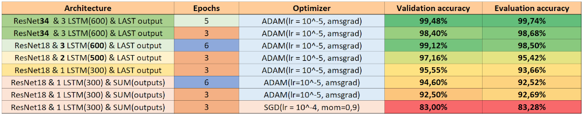

# Deepfake detection - PAF 2020

This project was realized as part of the 2020 PAF in Télécom Paris by Arthur Tran-Lambert, Mona Mokart and Vincent Josse, and supervised by Stéphane Safin, computer vision researcher at Télécom Paris. &nbsp; &nbsp; &nbsp; &nbsp; &nbsp; &nbsp; 

### What is this repository ?
This repository propose a deeplearning solution to identifiy deepfake videos. We worked as a group of 3 for 2 weeks and came up with an architecture with a very good accuracy (See details below). Our final solution uses deep convolutional & recurrent neural networks in order to classify whether a video was generated by state of the art deep video-generating models, or not.

## First Method: Image sampling over the video
Our first solution consisted in taking random frames from the video and classify them using traditional CNNs. 
The dataset we used was composed of 6000 .png images extracted from real and generated/fake videos using the [VoxCeleb dataset](http://www.robots.ox.ac.uk/~vgg/data/voxceleb/).

Using Residual Networks, we achieved a **97.0% validation accuracy**.

## Second Method: CNN as input of RNN
For the final solution, we combined a CNN with 3 layers of LSTM cells. The loss was calculated using only the last output of the LSTM. 

The dataset we used was composed of real and fake videos from [VoxCeleb dataset](http://www.robots.ox.ac.uk/~vgg/data/voxceleb/). We generated the fake videos using state of the art 2019 [first-order-model](https://github.com/AliaksandrSiarohin/first-order-model).

## Results:
Using our recurrent architecture from the Second method, we obtained these accuracies as listed in this table:

