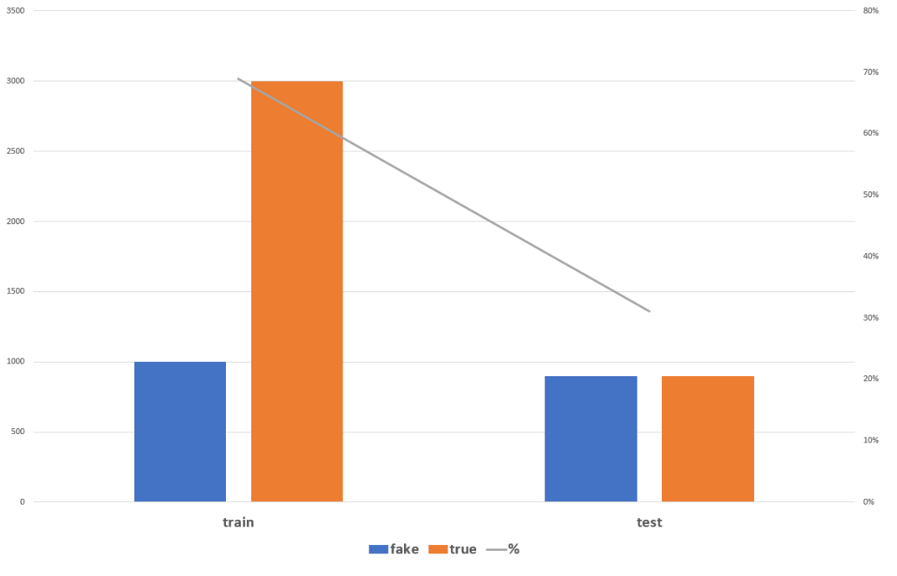
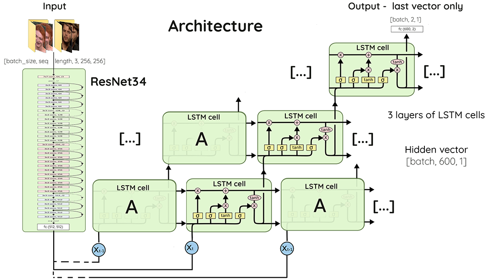
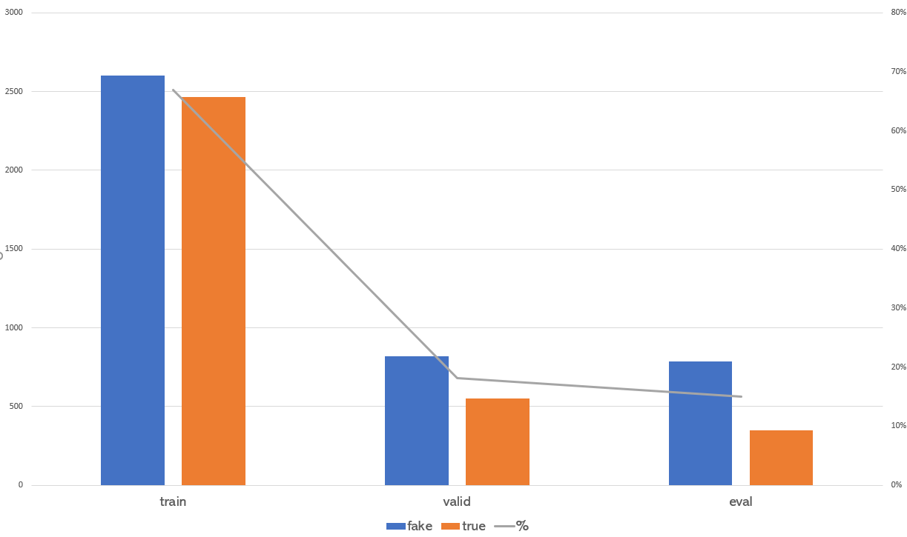
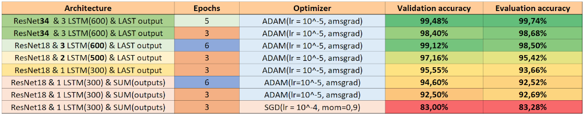

# Deepfake detection - PAF 2020
&nbsp; &nbsp; &nbsp; &nbsp; &nbsp; &nbsp; &nbsp; &nbsp; &nbsp; &nbsp; &nbsp; 

This project was realized as part of the 2020 PAF in Télécom Paris by Arthur Tran-Lambert, Mona Mokart and Vincent Josse, and supervised by Stéphane Safin, computer vision researcher at Télécom Paris.

### What is this repository ?
This repository propose a deep learning solution in python to identifiy deepfake videos using the [pyTorch framework](https://pytorch.org/). We worked as a group of 3 for 2 weeks and came up with an architecture with a very good accuracy (See details below). Our final solution uses deep convolutional & recurrent neural networks in order to classify whether a video was generated by [state of the art deep video-generating models](https://github.com/AliaksandrSiarohin/first-order-model), or not.

## Repository Structure

`/activation-visualization/` This folder contains a script used to visualize which part of the image is used by the CNN to take a decision. See [Pytorch grad cam](https://github.com/jacobgil/pytorch-grad-cam) for more details.

`/data-processing/` This folder holds all the script we used in order to process the [VoxCeleb dataset](http://www.robots.ox.ac.uk/~vgg/data/voxceleb/) and the generated deepfake videos.

`/deepfake_Classifier.py` This is the main script. It is used to train the architecture we designed.

`/Image - CNN classifier.py` This is a basic CNN we trained to recognize a fake frame from a real one. It leads to poor performance and it is harder to train than a [residual network like ResNet50](https://arxiv.org/abs/1512.03385).

`/Image - ResNet fine tuning classifier.py` This is the code used to fine-tune ResNets. It is efficient but not as much as the recurrent neural network with videos.

`/Evaluation - Deepfake Video Classifier.py` This script is used to run the evaluation on loaded weights.

## First Method: Image sampling over the video
Our first solution consisted in taking random frames from the video and classify them using traditional CNNs.
The dataset we used was composed of 6000 .png images extracted from real and generated/fake videos using the [VoxCeleb dataset](http://www.robots.ox.ac.uk/~vgg/data/voxceleb/).

Using Residual Networks, we achieved at best **97.0% validation accuracy**.

## Second Method: CNN as input of RNN
For the final solution, we combined a CNN with 3 layers of LSTM cells. The loss was calculated using only the last output of the LSTM.
We used sorted .png folders as input in our code to reduce preprocessing time but .mp4 videos can also easily be processed as a pyTorch tensor to fit in our network.

The dataset we used was composed of real and fake videos from [VoxCeleb dataset](http://www.robots.ox.ac.uk/~vgg/data/voxceleb/). We generated the fake videos using state of the art 2019 [first-order-model](https://github.com/AliaksandrSiarohin/first-order-model).

## Results
Using our recurrent architecture from the Second method, we obtained these accuracies:

Please note that the parameters and the structure in the above architecture figure are those that were used to achieve our best evaluation accuracy in the previous table.

Our weights with the best performance can be downloaded here: [Weights](https://drive.google.com/file/d/1WnJ96K3lsuu2RmwfM9kWCd-Bva9sf0LZ/view?usp=sharing)
Use pytorch state_dict loader to perform predictions with these weights.
